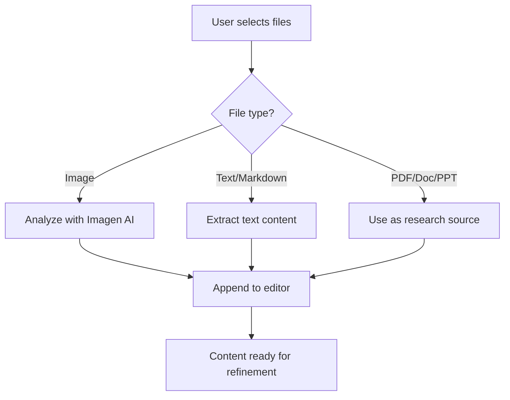
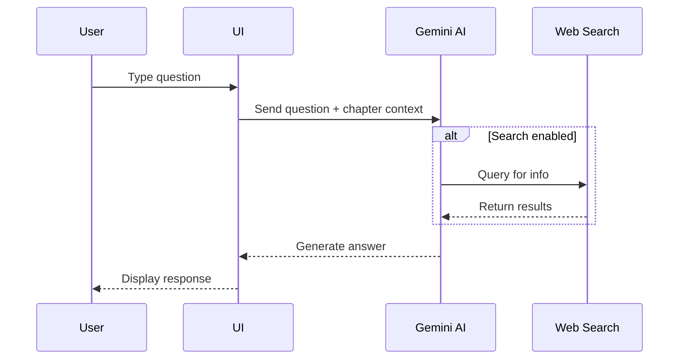
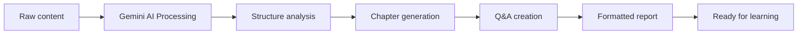
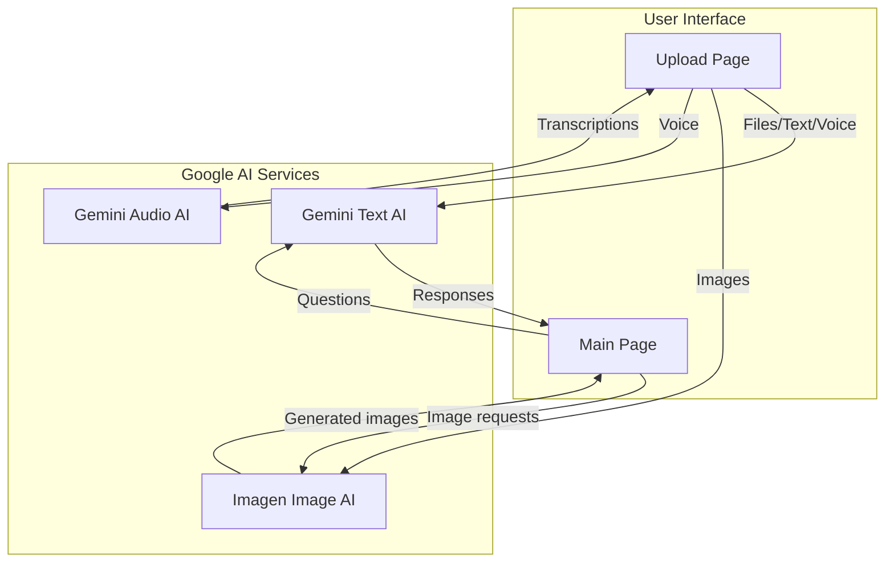

# Design Document

## Overview

The documentation page will be a standalone HTML page that provides comprehensive, user-friendly documentation for the ReflectLearning AI Tutor application. It will explain features organized by page (Upload Page and Main Page), subdivide each feature into specific user needs with step-by-step instructions, and include Mermaid.js diagrams to visualize workflows. The page will maintain visual consistency with the main application and be fully responsive.

## Architecture

### File Structure
```
/
├── docs/
│   └── user-guide.html          # New documentation page
├── index.html                    # Updated with link to documentation
└── (existing files...)
```

### Technology Stack
- **HTML5**: Semantic markup for content structure
- **Tailwind CSS**: Utility-first CSS (via CDN, consistent with main app)
- **Mermaid.js**: Diagram rendering (via CDN)
- **JavaScript**: Minimal vanilla JS for Mermaid initialization and smooth scrolling

## Components and Interfaces

### 1. Navigation Header
**Purpose**: Provide branding and navigation back to the main application

**Structure**:
- Logo/branding (ReflectLearning AI Tutor)
- "Back to App" button/link
- Sticky positioning for easy access while scrolling

**Styling**:
- Background: `#111722` (consistent with app)
- Text: White with `#135bec` accent for links
- Font: Lexend (primary), Inter (UI elements)

### 2. Hero Section
**Purpose**: Welcome users and provide overview

**Content**:
- Page title: "ReflectLearning User Guide"
- Brief description of the application
- Quick navigation to main sections

### 3. Table of Contents
**Purpose**: Enable quick navigation to specific sections

**Structure**:
- Sticky sidebar (desktop) or collapsible menu (mobile)
- Anchor links to major sections:
  - Getting Started
  - Upload Page Features
  - Main Page Features
  - Technical Details
  - FAQ

**Behavior**:
- Smooth scroll to sections on click
- Active section highlighting

### 4. Feature Sections

#### 4.1 Upload Page Section
**Subsections** (each with user need, description, steps, and diagram):

1. **File Uploading**
   - User need: Upload PDF, Word, PowerPoint, or image files
   - Steps:
     1. Click "Upload Files" button or drag files into drop zone
     2. Select one or multiple files from file picker
     3. Wait for analysis progress (0-100%)
     4. View extracted content in editor
   - Diagram: File upload workflow (flowchart)

2. **Text Input**
   - User need: Paste or type learning content directly
   - Steps:
     1. Click in the text editor area
     2. Type or paste content (Ctrl+V / Cmd+V)
     3. Content appears in editor for refinement
   - Diagram: Text input flow

3. **Voice Input**
   - User need: Speak learning topics or content
   - Steps:
     1. Click microphone icon
     2. Grant microphone permissions if prompted
     3. Speak clearly into microphone
     4. Click stop when finished
     5. Transcribed text appears in search box
   - Diagram: Voice input sequence

4. **Search/URL Input**
   - User need: Search for topics or provide URLs for content
   - Steps:
     1. Type topic or paste URL in search box
     2. Toggle "Search Grounding" if needed
     3. Click search icon or press Enter
     4. AI searches and generates content
     5. Content streams into editor
   - Diagram: Search workflow with grounding option

5. **Content Refinement**
   - User need: Transform raw content into structured learning report
   - Steps:
     1. Add all desired content to editor
     2. Click "Refine" button
     3. AI processes and structures content
     4. Refined report appears with chapters
     5. Click "Start Learning" to proceed
   - Diagram: Refinement process flow

#### 4.2 Main Page Section
**Subsections**:

1. **Reading Chapters**
   - User need: Navigate and read structured learning content
   - Steps:
     1. View chapter list in left sidebar
     2. Click chapter to navigate
     3. Read content in main area
     4. Use scroll or chapter navigation
   - Diagram: Chapter navigation structure

2. **Chatting with AI Tutor**
   - User need: Ask questions about current chapter
   - Steps:
     1. Type question in chat input (right sidebar)
     2. Toggle "Search" if web search needed
     3. Press Enter or click send
     4. AI responds with context-aware answer
     5. Continue conversation as needed
   - Diagram: Chat interaction sequence

3. **Editing Chapter Content**
   - User need: Modify chapter text directly
   - Steps:
     1. Right-click on chapter content
     2. Select "Edit" from context menu
     3. Modify markdown in editor
     4. Click "Save" to apply changes
     5. Click "Cancel" to discard
   - Diagram: Edit workflow

4. **Rewriting Chapters**
   - User need: AI-assisted chapter improvement
   - Steps:
     1. Right-click on chapter
     2. Select "Rewrite" from context menu
     3. AI regenerates chapter content
     4. Review streamed content
     5. Accept or edit further
   - Diagram: Rewrite process

5. **Adding New Chapters**
   - User need: Expand learning content with new topics
   - Steps:
     1. Click "+" button in chapter sidebar
     2. Enter chapter title in prompt
     3. Provide topic details
     4. AI generates new chapter
     5. New chapter appears in list
   - Diagram: Chapter creation flow

6. **Reflection Mode**
   - User need: Test understanding through AI-guided questions
   - Steps:
     1. Click "Reflection" mode toggle
     2. AI presents questions about current chapter
     3. Answer via text or voice
     4. Receive feedback and hints
     5. Progress through reflection session
   - Diagram: Reflection interaction flow

### 5. Technical Details Section
**Purpose**: Explain system architecture for advanced users

**Content**:
- AI models used (Gemini, Imagen, Audio)
- Data flow diagram (Mermaid)
- Component architecture
- Data storage (temporary, no persistence)
- Internet connectivity requirements

### 6. FAQ Section
**Purpose**: Address common questions

**Content**:
- How to get API key
- Supported file formats
- Privacy and data handling
- Browser compatibility
- Troubleshooting common issues

## Data Models

### Mermaid Diagram Definitions

#### 1. File Upload Workflow


#### 2. Chat Interaction Sequence


#### 3. Content Refinement Process


#### 4. System Architecture


## Error Handling

### User-Facing Errors
1. **Missing API Key**: Display clear message with setup instructions
2. **File Upload Failures**: Show error state with retry option
3. **Network Issues**: Graceful degradation with offline message
4. **Unsupported Browsers**: Warning banner with compatibility info

### Diagram Rendering Errors
- Fallback to text description if Mermaid fails to load
- Console logging for debugging
- Graceful degradation without breaking page layout

## Testing Strategy

### Manual Testing Checklist
1. **Responsiveness**
   - Test on mobile (320px-767px)
   - Test on tablet (768px-1023px)
   - Test on desktop (1024px+)

2. **Navigation**
   - Verify all anchor links work
   - Test smooth scrolling behavior
   - Confirm back-to-app link functions

3. **Diagrams**
   - Verify all Mermaid diagrams render
   - Check diagram responsiveness
   - Test fallback behavior

4. **Cross-Browser**
   - Chrome/Edge (Chromium)
   - Firefox
   - Safari
   - Mobile browsers

5. **Accessibility**
   - Keyboard navigation
   - Screen reader compatibility
   - Color contrast ratios
   - Alt text for diagrams

### Performance Testing
- Page load time < 2 seconds
- Mermaid rendering time < 1 second per diagram
- Smooth scrolling performance

## Implementation Notes

### Responsive Design Breakpoints
- Mobile: < 768px (single column, stacked content)
- Tablet: 768px - 1023px (two columns where appropriate)
- Desktop: ≥ 1024px (full layout with sidebar)

### Color Palette (from main app)
- Background: `#111722`
- Secondary: `#232f48`
- Accent: `#135bec`
- Text: `#ffffff` (primary), `#92a4c9` (secondary)

### Typography
- Headings: Lexend (700-900 weight)
- Body: Lexend (400-500 weight)
- UI elements: Inter (400-700 weight)
- Code: Monospace

### Mermaid Configuration
```javascript
mermaid.initialize({
  theme: 'dark',
  themeVariables: {
    primaryColor: '#135bec',
    primaryTextColor: '#fff',
    primaryBorderColor: '#232f48',
    lineColor: '#92a4c9',
    secondaryColor: '#232f48',
    tertiaryColor: '#111722'
  }
});
```

### Index Page Modification
Add navigation link in header:
```html
<a href="docs/user-guide.html" class="text-[#135bec] hover:text-white">
  Documentation
</a>
```

## Design Decisions and Rationales

1. **Single HTML File**: Simplifies deployment and maintenance; all content in one place
2. **CDN Dependencies**: Faster loading, no build step required, consistent with main app
3. **Mermaid for Diagrams**: Text-based, version-controllable, easy to update
4. **Sticky Navigation**: Improves UX for long-form documentation
5. **Feature-First Organization**: Users think in terms of "what can I do" not "how is it built"
6. **Progressive Disclosure**: Start with common tasks, provide technical details for advanced users
7. **Responsive-First**: Mobile usage is significant, ensure great experience on all devices
