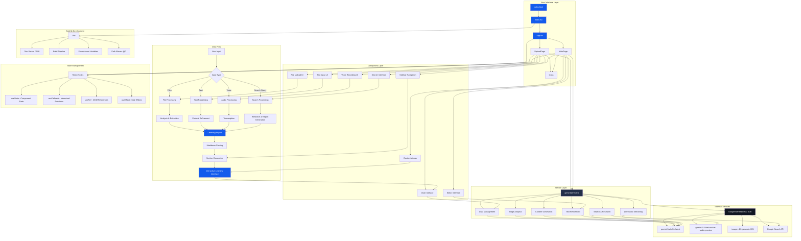
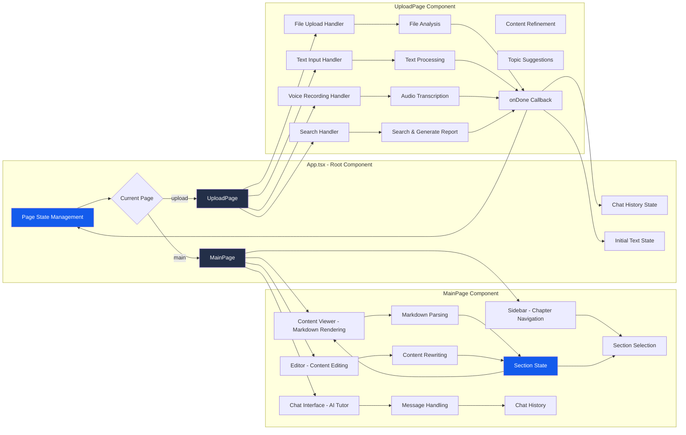
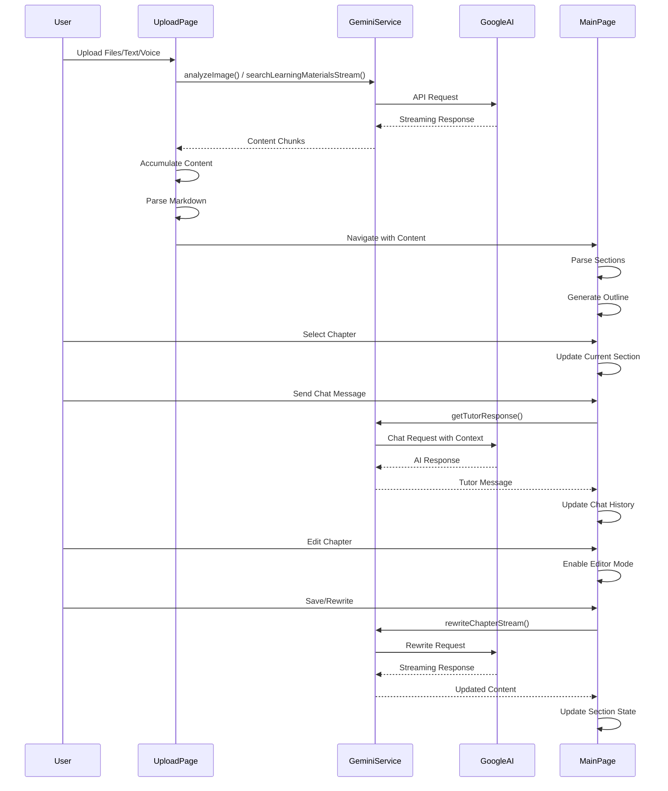

# ReflectLearning AI Tutor - Architecture

## System Architecture Diagram



## Component Architecture



## Data Flow Architecture



## Service Layer Architecture

```mermaid
graph TB
    subgraph "geminiService.ts"
        A[GoogleGenAI Client]
        
        subgraph "Content Generation"
            B1[searchLearningMaterialsStream]
            B2[refineTextStream]
            B3[rewriteChapterStream]
            B4[rewriteQnAStream]
        end
        
        subgraph "Chat & Interaction"
            C1[createChat]
            C2[sendMessageToChat]
            C3[getTutorResponse]
            C4[refineTutorPrompt]
        end
        
        subgraph "Media Processing"
            D1[analyzeImage]
            D2[generateImage]
            D3[connectLive - Audio]
        end
        
        subgraph "Utilities"
            E1[refineUserPrompt]
            E2[suggestExtendedTopics]
            E3[generateParagraphTitle]
            E4[generateChapterTitle]
        end
    end
    
    A --> B1
    A --> B2
    A --> B3
    A --> B4
    A --> C1
    A --> C2
    A --> C3
    A --> C4
    A --> D1
    A --> D2
    A --> D3
    A --> E1
    A --> E2
    A --> E3
    A --> E4
    
    B1 --> F[Streaming Generator]
    B2 --> F
    B3 --> F
    B4 --> F
    
    C3 --> G[Search Integration]
    B1 --> G
    B2 --> G
    
    D3 --> H[WebRTC Audio Stream]
    
    style A fill:#135bec,color:#fff
    style F fill:#232f48,color:#fff
    style G fill:#232f48,color:#fff
    style H fill:#232f48,color:#fff
```



## State Management Architecture

```mermaid
graph TB
    subgraph "App State"
        A1[currentPage: 'upload' | 'main']
        A2[initialText: string]
        A3[chatHistory: ChatMessage[]]
    end
    
    subgraph "UploadPage State"
        B1[pastedText: string]
        B2[uploadedFiles: UploadFile[]]
        B3[searchQuery: string]
        B4[isSearching: boolean]
        B5[isRecording: boolean]
        B6[isRefining: boolean]
        B7[suggestedTopics: string[]]
        B8[isMarkdownMode: boolean]
    end
    
    subgraph "MainPage State"
        C1[messages: ChatMessage[]]
        C2[userInput: string]
        C3[isLoading: boolean]
        C4[sections: Section[]]
        C5[currentSectionIndex: number]
        C6[reportTitle: string]
        C7[isGenerating: boolean]
        C8[editingSectionIndex: number | null]
        C9[editingContent: string]
        C10[viewMode: 'learning' | 'reflection']
        C11[isSidebarCollapsed: boolean]
    end
    
    subgraph "Section Type"
        D1[id: string]
        D2[type: 'preamble' | 'chapter' | 'conclusion' | 'sources']
        D3[title: string]
        D4[content: string]
    end
    
    A2 --> C4
    A3 --> C1
    
    B1 --> A2
    B2 --> A2
    B3 --> A2
    
    C4 --> D1
    C4 --> D2
    C4 --> D3
    C4 --> D4
    
    C5 --> C4
    C8 --> C4
    
    style A1 fill:#135bec,color:#fff
    style C4 fill:#135bec,color:#fff
    style C1 fill:#232f48,color:#fff
```

## Key Features & Flows

### 1. Upload & Content Generation Flow
- User uploads files (PDF, images, documents) or provides text/URLs
- Files are analyzed using Gemini AI (image analysis, content extraction)
- Search queries trigger web-grounded research
- Content is refined and structured into a comprehensive learning report
- Report is parsed into sections (preamble, chapters, conclusion, sources)

### 2. Interactive Learning Flow
- Sidebar navigation shows chapter outline with progress tracking
- Content viewer renders Markdown with custom components for navigation
- Users can navigate between chapters, edit content, and rewrite sections
- Q&A sections provide structured learning checkpoints

### 3. AI Tutor Chat Flow
- Context-aware chat using current chapter content
- Optional web search integration for up-to-date information
- Message history maintained for conversation continuity
- Support for image generation via `/generate` command
- Prompt refinement to improve user queries

### 4. Voice Interaction Flow
- Live audio streaming using Gemini native audio support
- Real-time transcription of user speech
- Voice-based tutoring with audio responses
- WebRTC integration for microphone access

### 5. Content Editing Flow
- Right-click context menu for chapter actions
- Inline editing with live preview
- AI-powered chapter rewriting
- Q&A section regeneration
- Append chat responses to chapters

## Technology Stack Summary

**Frontend:**
- React 19.2.0 with TypeScript 5.8.2
- Vite 6.2.0 (dev server, build tooling)
- React Markdown with GFM support
- Tailwind-style utility classes

**AI Services:**
- Google Generative AI SDK v1.29.0
- Models: gemini-flash-lite-latest, gemini-2.5-flash-native-audio-preview, imagen-4.0-generate-001
- Features: Chat, streaming, image generation, audio, web search

**State Management:**
- React Hooks (useState, useCallback, useRef, useEffect)
- Component-level state (no external state library)

**Build & Dev:**
- TypeScript with bundler module resolution
- Path aliases (@/* → root)
- Environment variables via .env.local
- Dev server on port 3000
