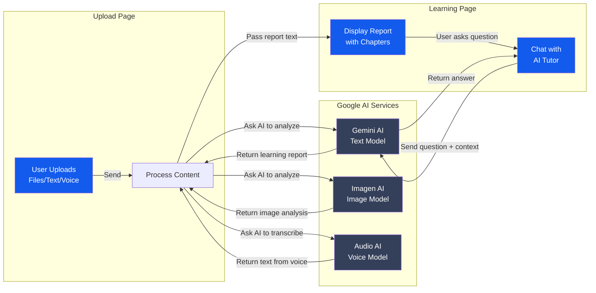
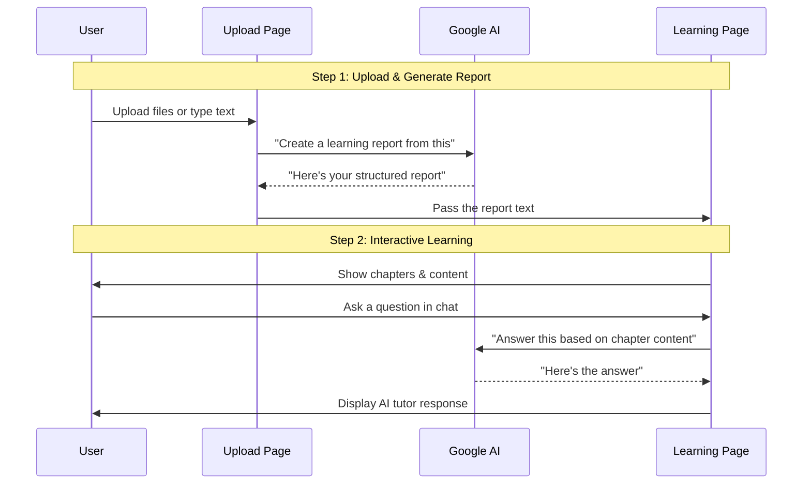
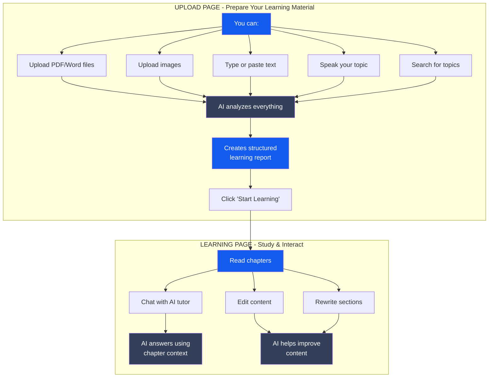
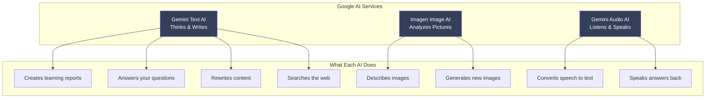

# ReflectLearning - Simple Architecture Overview

## How Data Flows Between Pages

## Step-by-Step Journey

## What Happens on Each Page

## The Three AI Models Used

## Key Points

### Data Transfer Between Pages
1. **Upload Page** collects your materials (files, text, voice)
2. **AI processes** everything and creates a structured report
3. **Report text** is passed to the Learning Page
4. **Learning Page** displays the report and lets you interact with it

### What Gets Saved
- Your uploaded files are analyzed but **not stored permanently**
- The **generated report text** is kept in memory while you learn
- Your **chat history** with the AI tutor is saved during your session
- When you refresh or close, everything resets (no database)

### Internet Connection Required
- All AI processing happens on **Google's servers**
- Your browser sends requests and receives responses
- No AI runs on your computer - it's all in the cloud

### Privacy Note
- Files and text are sent to Google AI for processing
- No data is stored in a database by this app
- Each session is independent and temporary
